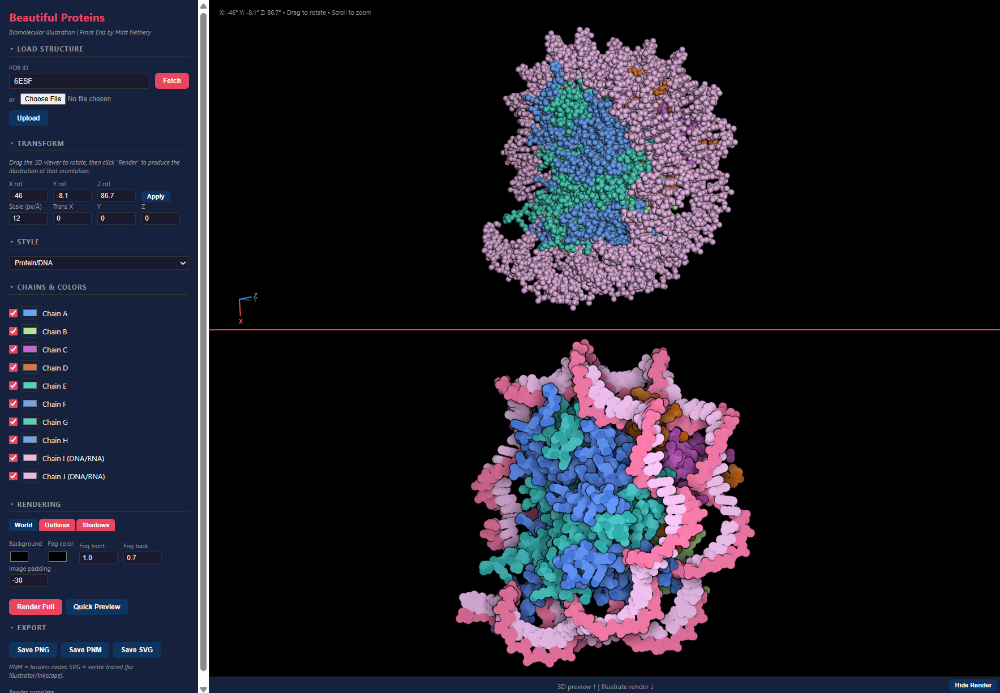

# Beautiful Proteins
#### A fully local web front end

<div style="text-align: center; background-color: #000000; width=100%;" align="center">
    </img>
</div>
<br/>
A local web interface for <a href="https://github.com/ccsb-scripps/Illustrate">Illustrate</a>, David S. Goodsell's biomolecular illustration tool. Renders proteins in Goodsell's signature non-photorealistic style: space-filling atoms with contour outlines, soft shadows, and depth fog. 
<br/><br/>
This project wraps the original Fortran rendering engine in a modern web UI with an interactive 3D preview, so you can visually orient a protein and then render a publication-quality Goodsell-style illustration at that exact orientation. This all occurs locally, with no data sent to external servers.


## Features

- **Interactive 3D preview** with real-time rotation sync to the Illustrate renderer
- **Multiple coloring styles** — Entity Chain, Protein/DNA (with per-nucleotide backbone highlighting), CPK (by element), One Color
- **Per-chain controls** — custom colors and visibility toggles for each chain
- **Full parameter control** — background, fog, outlines, shadows, scale, translation
- **Export as PNG, PNM, or SVG** (vector-traced for Illustrator/Inkscape)

## Prerequisites

- **macOS, Linux, or WSL2**
- **[uv](https://docs.astral.sh/uv/)** (Python package manager)
- **gfortran** (GNU Fortran compiler)

### Install uv

```bash
curl -LsSf https://astral.sh/uv/install.sh | sh
```

### Install gfortran

```bash
# macOS
brew install gcc

# Ubuntu/Debian/WSL2
sudo apt install gfortran
```

## Quick start

```bash
git clone <repo-url>
cd beautiful-proteins/webapp
./start.sh
```

Open **http://127.0.0.1:5001** in your browser.

The startup script handles everything: installs Python dependencies via uv, compiles the Fortran binary if needed, and starts the server.

### Manual setup

```bash
cd beautiful-proteins

# Install dependencies
uv sync

# Compile the Illustrate binary (one time)
gfortran Illustrate/illustrate.f -o Illustrate/illustrate

# Start the server
cd webapp
uv run python app.py
```

Once the web app is successfully running, open **http://127.0.0.1:5001** in your browser and and you'll see the web interface in action. I'm showing some beautiful sub-nucleosome particles here (6ESF):

<div style="text-align: center;" align="center">
    
</div>


## Usage

### 1. Load a structure

Enter a **PDB ID** (e.g. `2HHB`, `7L48`) and click Fetch, or upload a `.pdb` file from disk.

### 2. Orient the molecule

- **Rotate**: click and drag
- **Zoom**: scroll wheel
- **Translate**: right-click and drag

The 3D axis legend (bottom-left) shows Illustrate's X/Y/Z coordinate system. Rotation angles sync automatically to the sidebar.

### 3. Choose a style

| Style | Description |
|-------|-------------|
| Entity Chain | Distinct color per chain |
| Protein/DNA | Protein blue, nucleic acids with high-contrast backbone highlighting |
| CPK | Color by element (C, N, O, S, P...) |
| One Color | Single uniform color |

### 4. Adjust render settings

The **Rendering** section in the sidebar has three tabs for fine-tuning the illustration:

- **World** — Background color, fog color/intensity, and image padding
- **Outlines** — Contour line thresholds for atom edges, subunit boundaries, and residue boundaries. Lower values produce more outlines; higher values produce cleaner shapes.
- **Shadows** — Toggle soft conical shadows on/off and control their strength, spread, and maximum darkness

You can also customize individual chains under **Chains & Colors** — toggle visibility with checkboxes or click the color swatch to pick a custom color. Use **Quick Preview** to iterate on settings before committing to a full render.

### 5. Render and export

- **Quick Preview** — half-scale, ~2-5 seconds
- **Render Full** — full resolution, ~5-30 seconds

Export as **PNG**, **PNM** (lossless), or **SVG** (vector paths for Illustrator/Inkscape).

## Project structure

```
beautiful-proteins/
├── pyproject.toml            # Python dependencies (uv)
├── Illustrate/
│   ├── illustrate.f          # Fortran source (Goodsell, Apache 2.0)
│   └── illustrate            # Compiled binary
├── webapp/
│   ├── app.py                # Flask backend
│   ├── start.sh              # One-command startup
│   ├── templates/index.html  # Frontend HTML
│   ├── static/
│   │   ├── css/style.css     # Stylesheet
│   │   └── js/app.js         # Frontend JavaScript (3Dmol.js + controls)
│   ├── uploads/              # PDB files
│   └── output/               # Rendered images
└── README.md
```

## Limitations

- Space-filling illustrations only (not ribbon/cartoon) — this is the Goodsell style
- Maximum 3000x3000 px image size and 350,000 atoms (Fortran limits)
- Perspective differences between 3Dmol.js preview and orthographic Illustrate render

## Credits
If you need to cite this for a publication, <u>please cite <a href="https://github.com/ccsb-scripps/Illustrate">Goodsell's original publication</a> listed below!</u>

- **<a href="https://github.com/ccsb-scripps/Illustrate">Illustrate</a>**: David S. Goodsell, CCSB/Scripps Research (Apache 2.0)
- **3Dmol.js**: Rego & Koes (2015) Bioinformatics 31, 1322-1324
- **vtracer**: Vision Cortex — raster-to-vector tracing
- **PDB files**: RCSB Protein Data Bank (rcsb.org)
